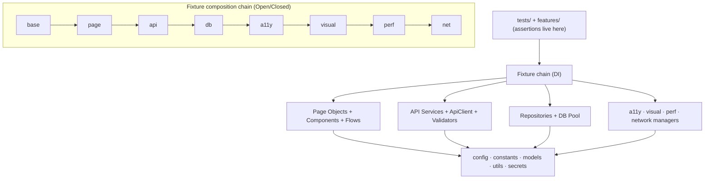

<!-- ====================================================================== -->
<!--  OmniQA — Enterprise Playwright Automation Framework                    -->
<!-- ====================================================================== -->

<div align="center">

<!-- LOGO PLACEHOLDER — drop assets/omniqa-logo.png here -->


# OmniQA

### Enterprise Playwright Automation Framework

_UI · API · Database · End-to-End · BDD · Accessibility · Visual · Performance · Network · CI/CD_

[](#cicd)
[](https://playwright.dev)
[](https://www.typescriptlang.org/)
[](https://nodejs.org)
[](#repository-statistics)
[](#playwright-projects)
[](#performance-considerations)
[](#license)

</div>

---

## Table of Contents

- [Overview](#overview) · [Why OmniQA](#why-omniqa) · [Key Features](#key-features) · [Architecture Overview](#architecture-overview)
- [Folder Structure](#folder-structure) · [Technology Stack](#technology-stack) · [Installation](#installation) · [Configuration](#configuration) · [Environment Variables](#environment-variables)
- [Execution Commands](#execution-commands) · [Playwright Projects](#playwright-projects) · [Framework Layers](#framework-layers) · [Data Management](#data-management)
- [Supported Browsers](#supported-browsers) · [Supported Applications](#supported-applications) · [Reports & Screenshots](#reports--screenshots) · [CI/CD](#cicd)
- [Known Limitations](#known-limitations) · [Roadmap](#roadmap) · [Best Practices](#best-practices) · [Security](#security-considerations) · [Performance](#performance-considerations)
- [Troubleshooting](#troubleshooting) · [FAQ](#faq) · [Interview Highlights](#interview-highlights) · [Contributing](#contributing) · [License](#license) · [Author](#author) · [Acknowledgements](#acknowledgements)

---

## Overview

**OmniQA** is a production-grade test-automation framework built on **Playwright + strict TypeScript**.
It exercises real public demo applications across **UI, API, Database, End-to-End, BDD, Accessibility,
Visual-regression, Performance, and Network** layers — all wired together through a **dependency-injection
fixture chain** so specs never touch Playwright primitives or raw SQL directly.

Source code in `src/` contains **no assertions**: page objects, API services, and repositories expose
state, and the specs assert on it. Every value (URLs, credentials, budgets, thresholds) is **config-driven
from `.env`** — there are no hardcoded environment values anywhere.

> **Status:** All 24 build phases complete. The framework runs UI/API/DB/E2E/BDD plus accessibility,
> visual, performance, and network suites, and ships full CI/CD for **GitHub Actions, Jenkins, and Azure DevOps**
> with Docker. Quality gates (`typecheck` · `lint` · `format` · `deps:check` · `audit`) are green.

---

## Why OmniQA

| Problem in typical frameworks                 | How OmniQA solves it                                                        |
| --------------------------------------------- | --------------------------------------------------------------------------- |
| Tests call Playwright/SQL directly → brittle  | Page Objects, API services, repositories injected via **fixtures (DI)**     |
| Hardcoded URLs/creds/timeouts                 | **Typed, validated, fail-fast config** from `.env` (Singleton + Facade)     |
| One test type per repo (UI _or_ API)          | **One repo, 9 test layers** sharing the same DI chain                       |
| Flaky waits / sleeps                          | **Web-first auto-waiting only** — zero fixed sleeps                         |
| "Works on my machine"                         | **Dockerised runner + Postgres**, identical across 3 CI systems             |
| No quality enforcement                        | **ESLint + Prettier + Husky + commitlint + c8 + depcheck + audit**          |
| Accessibility / visual / perf bolted on later | First-class modules with their own **fixtures, assertions, and dashboards** |

---

## Key Features

- ✅ **UI automation** — advanced Page Object Model, reusable components, business-flow layer, cross-browser + mobile
- ✅ **API automation** — reusable `ApiClient`, typed service classes, retry/backoff, AJV schema/contract validation, SLA checks
- ✅ **Database testing** — `pg` pool, repository pattern, constraint/FK/view/stored-function checks, injection-safety
- ✅ **End-to-end** — API lifecycle, UI journey, DB lifecycle, **API→DB reconciliation**
- ✅ **BDD** — Cucumber in the same repo, reusing page objects & services
- ✅ **Accessibility** — `@axe-core/playwright` scanner, keyboard navigator, WCAG assertions, HTML dashboard
- ✅ **Visual regression** — `toHaveScreenshot` wrapper, freeze stylesheet, dynamic-element masking, committed baselines
- ✅ **Performance smoke** — Navigation/Paint/LCP/Resource timing, env-driven budgets, optional Lighthouse
- ✅ **Network control** — route mocking, interception, response rewriting, traffic capture, HAR record/replay
- ✅ **Secrets** — pluggable `SecretProvider` (env + AES-256-GCM encrypted vault)
- ✅ **Reporting** — list · HTML · JUnit · Allure · custom summary · flaky-detection · a11y/perf dashboards
- ✅ **Logging** — Winston, per-test correlation IDs, failure-time log capture & attachment
- ✅ **CI/CD** — GitHub Actions, Jenkins, Azure DevOps, Docker, CodeQL, OWASP Dependency-Check, SonarCloud

---

## Architecture Overview



**Principle:** each fixture layer `.extend()`s the previous; specs always `import { test } from '@fixtures/index'`
and never change that line as the chain grows. See [docs/PROJECT_ANALYSIS.md](docs/PROJECT_ANALYSIS.md) for full diagrams.

---

## Folder Structure

```text
omniqa-playwright-framework/
├── src/                         # Framework engine (no assertions)
│   ├── accessibility/           # axe scanner, keyboard navigator, a11y assertions + reporter
│   ├── api/                     # ApiClient, response & schema validators
│   ├── components/              # Reusable UI components (base + saucedemo/orangehrm)
│   ├── config/                  # env accessor + validated Singleton config facade
│   ├── constants/               # http, endpoints, routes, timeouts, paths
│   ├── cucumber/                # Cucumber World + hooks
│   ├── custom-reporters/        # summary-reporter + flaky-reporter
│   ├── database/                # pool, query-runner, db-assertions, availability
│   ├── fixtures/                # DI chain: base→page→api→db→a11y→visual→perf→net
│   ├── flows/                   # Business-flow layer (e.g. checkout)
│   ├── hooks/                   # global-setup / global-teardown
│   ├── models/                  # Typed domain + config models
│   ├── network/                 # NetworkManager (route mock / intercept / HAR)
│   ├── pages/                   # Page Object Model (base + saucedemo/orangehrm)
│   ├── performance/             # collector, budget assertions, reporter, Lighthouse runner
│   ├── repositories/            # Repository pattern (base + employee/department/product-record)
│   ├── schemas/                 # AJV JSON schemas (contract testing)
│   ├── secrets/                 # SecretProvider (env + encrypted vault)
│   ├── services/                # API service classes (auth/booking/pet/post/product/user)
│   ├── utils/                   # logger, crypto, retry, wait, date, random, file, allure
│   └── (builders, factories, helpers, middlewares, types)   # reserved scaffold (currently empty)
├── tests/                       # Specs (assertions live here)
│   ├── accessibility/ api/ db/ e2e/ network/ performance/ setup/ ui/ visual/
├── features/                    # Cucumber .feature files
├── step-definitions/            # Cucumber step definitions
├── scripts/db/                  # schema.sql, provision.sh, apply-schema.ts
├── azure/templates/             # Azure DevOps step templates
├── .github/workflows/           # ci.yml, codeql.yml, security.yml
├── .husky/                      # pre-commit, commit-msg, pre-push hooks
├── docs/                        # Documentation (this folder)
├── Dockerfile, docker-compose.yml, Jenkinsfile, azure-pipelines.yml
└── playwright.config.ts, tsconfig.json, cucumber.js, package.json
```

> **Note (honest):** `src/builders`, `src/factories`, `src/helpers`, `src/middlewares`, and `src/types`
> currently contain only a `.gitkeep` — they are reserved extension points, not yet used.

---

## Technology Stack

| Category      | Technology                                                               |
| ------------- | ------------------------------------------------------------------------ |
| Language      | TypeScript (strict, `noUncheckedIndexedAccess`, zero `any`)              |
| Test runner   | Playwright Test `^1.49`                                                  |
| BDD           | Cucumber `^11` (`@cucumber/cucumber`)                                    |
| Database      | PostgreSQL via `pg` `^8`                                                 |
| Validation    | AJV `^8` + `ajv-formats`                                                 |
| Logging       | Winston `^3` + `winston-transport`                                       |
| Accessibility | `@axe-core/playwright` `^4` (+ `axe-core` types)                         |
| Performance   | W3C timing APIs + optional Lighthouse CLI + `chrome-launcher`            |
| Data          | `@faker-js/faker`, `exceljs`, `csv-parse`                                |
| Reporting     | Playwright HTML/JUnit, Allure (`allure-playwright`, `allure-js-commons`) |
| Quality       | ESLint, Prettier, Husky, lint-staged, commitlint, c8, depcheck           |
| CI/CD         | GitHub Actions, Jenkins, Azure DevOps, Docker, CodeQL, OWASP, SonarCloud |

---

## Installation

```bash
# Prerequisites: Node ≥ 20 (.nvmrc pins 22.x), npm ≥ 10, (optional) PostgreSQL 16, (optional) Java JRE for Allure
nvm use                      # Node 22.x
npm install                  # dependencies + Husky hooks (via prepare)
npm run install:browsers     # Playwright browsers (chromium/firefox/webkit) + OS deps
cp .env.example .env         # create local env file
```

## Configuration

Configuration flows: `.env` → typed accessor (`src/config/env.ts`) → **validated Singleton facade**
(`src/config/config.ts`). Choose the environment with `TEST_ENV` (`dev | qa | uat | staging | production`).
The config **fails fast** on malformed URLs, bad DB ports, or out-of-range visual/performance ratios.

### Environment Variables

44 variables are documented in [`.env.example`](.env.example). Grouped summary:

| Group               | Variables                                                                                                                                     |
| ------------------- | --------------------------------------------------------------------------------------------------------------------------------------------- |
| Environment         | `TEST_ENV`                                                                                                                                    |
| UI URLs + creds     | `SAUCEDEMO_URL/USERNAME/PASSWORD`, `ORANGEHRM_URL/USERNAME/PASSWORD`                                                                          |
| API URLs + creds    | `RESTFUL_BOOKER_URL`, `REQRES_URL`, `DUMMYJSON_URL`, `JSONPLACEHOLDER_URL`, `PETSTORE_URL`, `REQRES_API_KEY`, `BOOKER_USERNAME/PASSWORD`      |
| Database            | `DB_HOST/PORT/NAME/USER/PASSWORD/SCHEMA/SSL/POOL_MAX/POOL_IDLE_TIMEOUT_MS`                                                                    |
| Execution           | `HEADLESS`, `DEFAULT_TIMEOUT_MS`, `EXPECT_TIMEOUT_MS`, `RETRIES`, `WORKERS`, `LOG_LEVEL`                                                      |
| Visual regression   | `VISUAL_MAX_DIFF_PIXEL_RATIO`, `VISUAL_THRESHOLD`, `VISUAL_ANIMATIONS`, `VISUAL_FULL_PAGE`                                                    |
| Performance budgets | `PERF_MAX_LOAD_MS`, `PERF_MAX_DCL_MS`, `PERF_MAX_TTFB_MS`, `PERF_MAX_FCP_MS`, `PERF_MAX_LCP_MS`, `PERF_MAX_TRANSFER_KB`, `PERF_MAX_RESOURCES` |
| Lighthouse          | `LIGHTHOUSE_ENABLED`, `LIGHTHOUSE_MIN_PERF_SCORE`                                                                                             |
| Secrets / crypto    | `ENCRYPTION_SECRET` (+ optional `SECRETS_VAULT_FILE` for the encrypted vault)                                                                 |

---

## Execution Commands

```bash
# All tests
npm test

# By layer / project
npm run test:ui          # ui-chromium project          npm run test:a11y      # accessibility
npm run test:api         # api project                  npm run test:visual    # visual regression
npm run test:db          # database tests               npm run test:perf      # performance smoke
npm run test:e2e         # end-to-end flows             npm run test:network   # route mocking / HAR
npm run test:bdd         # Cucumber scenarios

# By tag
npm run test:smoke       # @smoke          npm run test:regression  # @regression

# Modes
npm run test:headed      # headed browser  npm run test:debug   # PWDEBUG inspector  npm run test:parallel  # 4 workers

# Cross-environment
npm run test:dev | test:qa | test:uat | test:staging

# Quality gates
npm run verify           # typecheck + lint + format:check
npm run coverage         # c8 → coverage/lcov.info + HTML
npm run deps:check       # depcheck (unused deps)        npm run audit:security  # npm audit (high+)

# Docker
npm run docker:test      # build image + Postgres, run api+db projects
```

> ⚠️ Passing `--reporter` on the CLI **overrides** the config reporter set (the custom summary & flaky
> reporters won't run). Run without `--reporter` for the full reporting suite.

---

## Playwright Projects

12 projects defined in [`playwright.config.ts`](playwright.config.ts):

| Project         | Test dir              | Notes                                       |
| --------------- | --------------------- | ------------------------------------------- |
| `setup`         | `tests/setup`         | Logs in once, saves storage state for reuse |
| `ui-chromium`   | `tests/ui`            | Desktop Chrome (depends on `setup`)         |
| `ui-firefox`    | `tests/ui`            | Desktop Firefox                             |
| `ui-webkit`     | `tests/ui`            | Desktop Safari                              |
| `ui-mobile`     | `tests/ui`            | Pixel 7 (mobile responsive)                 |
| `api`           | `tests/api`           | No browser                                  |
| `db`            | `tests/db`            | PostgreSQL                                  |
| `e2e`           | `tests/e2e`           | UI + API + DB journeys                      |
| `accessibility` | `tests/accessibility` | axe-core scans                              |
| `visual`        | `tests/visual`        | Screenshot regression                       |
| `performance`   | `tests/performance`   | Timing budgets                              |
| `network`       | `tests/network`       | Route mocking / interception / HAR          |

---

## Framework Layers

### POM (Page Object Model)

`src/pages` — `BasePage` (navigation + logged web-first helpers) extended by 9 concrete pages (SauceDemo + OrangeHRM). Pages hold locators/actions only; **no assertions**. Components (`src/components`) are composed in, not inherited.

### API Layer

`src/api/clients/api-client.ts` (typed `APIRequestContext` wrapper with logging + retry) + 6 service classes (`src/services/*.api.ts`). Response/contract validation via `src/api/response-validator.ts`, `schema-validator.ts`, and AJV schemas in `src/schemas`.

### Database Layer

`src/database` — Singleton `pg` pool, `QueryRunner`, `DbAssertions`, availability probe. **Repository pattern** in `src/repositories` (base + employee/department/product-record). Schema + seed in `scripts/db/schema.sql`.

### BDD

`features/*.feature` (6 scenarios) + `step-definitions/*.ts` (15 steps) + `src/cucumber` World/hooks. Reuses page objects & services; path aliases resolved at runtime via `ts-node` + `tsconfig-paths` (`cucumber.js`).

### Reporting

6 reporters: `list`, `html`, `junit`, `allure-playwright`, custom `summary-reporter` (→ `reports/summary.json`), and `flaky-reporter` (→ `reports/flaky.json`). Accessibility & performance modules emit their own HTML dashboards.

### Logging

`src/utils/logger.ts` — Winston with console + `execution.log` + `error.log`, async-context correlation IDs, and a capture transport that attaches per-test logs on failure.

### Utilities

`src/utils` (12 files): `crypto` (AES-256-GCM), `retry`, `wait`, `date`, `random` (Faker), `file` (JSON/CSV/Excel), `allure`, plus log context/capture helpers.

### Fixtures

`src/fixtures` (8 layers) — the DI backbone. Public surface: `@fixtures/index` exports the fully-composed `test`/`expect`.

---

## Data Management

- **Synthetic data:** `@faker-js/faker` via `data` fixture (`firstName`, `email`, `uuid`, …).
- **External data:** JSON / CSV (`csv-parse`) / Excel (`exceljs`) helpers in `src/utils/file.util.ts`.
- **Test credentials:** injected from config, never hardcoded.
- **Secrets:** `@secrets` provider (env by default; AES-256-GCM encrypted vault when `SECRETS_VAULT_FILE` is set).

---

## Supported Browsers

Desktop **Chromium**, **Firefox**, **WebKit** (Safari), and mobile **Pixel 7** (via Playwright device emulation).

## Supported Applications

| Type | Application(s)                                                       |
| ---- | -------------------------------------------------------------------- |
| UI   | SauceDemo, OrangeHRM (open-source demo)                              |
| API  | Restful-Booker, ReqRes, DummyJSON, JSONPlaceholder, Swagger Petstore |
| DB   | Self-provisioned PostgreSQL 16 schema (`automation_db`)              |

---

## Reports & Screenshots

```bash
npm run report:html              # Playwright HTML report
npm run report:allure            # generate + open Allure (needs a JRE)
```

- Artifacts: `reports/` (html-report, junit, allure-results, summary.json, flaky.json, accessibility/, performance/)
- Failure diagnostics: screenshots (`only-on-failure`), video (`retain-on-failure`), trace (`on-first-retry`)
- Visual baselines: committed under `tests/**/*-snapshots/` (per project + platform)

---

## CI/CD

| System             | File(s)                                     | Highlights                                                                 |
| ------------------ | ------------------------------------------- | -------------------------------------------------------------------------- |
| **GitHub Actions** | `.github/workflows/ci.yml`                  | Quality gate → 9-project matrix (Postgres service) → Allure → notify       |
| **CodeQL**         | `.github/workflows/codeql.yml`              | SAST (security-and-quality queries)                                        |
| **Security**       | `.github/workflows/security.yml`            | OWASP Dependency-Check + npm audit + SonarCloud                            |
| **Jenkins**        | `Jenkinsfile`                               | Declarative pipeline, Docker image + Postgres sidecar, email notifications |
| **Azure DevOps**   | `azure-pipelines.yml` + `azure/templates/*` | Stages, templated per-project jobs, service container, Allure publishing   |
| **Docker**         | `Dockerfile`, `docker-compose.yml`          | Playwright image + Postgres, headless, volume-mapped reports               |

All three CI systems share **one DB-seeding path** (`npm run db:schema`) and the same Playwright image.

---

## Known Limitations

- **No git history yet** — repository has no commits/tags; versioning starts at `1.0.0`.
- **Reserved-but-empty dirs** — `builders/factories/helpers/middlewares/types` are scaffolding only.
- **`summary-reporter` flaky field** is computed from `interrupted` status (not true flakiness); the dedicated `flaky-reporter` is authoritative.
- **Duplication** — `escapeHtml`/`slugify` repeated in the a11y & performance reporters (refactor planned).
- **Distributed execution / browser grid** are documented (sharding + `connectOptions`) but not wired into config.
- **Lighthouse** is opt-in (`LIGHTHOUSE_ENABLED=true`) and needs a Chrome binary.
- **Some API tests** depend on third-party demo availability (e.g. ReqRes API key).

See [docs/FRAMEWORK_OPTIMIZATION.md](docs/FRAMEWORK_OPTIMIZATION.md) for the full adversarial review (15 findings).

## Roadmap

See [ROADMAP.md](ROADMAP.md). In short — **Completed:** all 24 build phases. **Planned:** shared report util, fix/remove summary flaky field, CI sharding, log rotation, generic `BaseRepository<T,Id>`, Docker-pinned visual baselines.

---

## Best Practices

- **Strict TypeScript**, never `any`, prefer `unknown`.
- **No assertions in `src/`** — pages/services/repos expose state; specs assert.
- **No hardcoded values** — everything via config/constants.
- **No fixed sleeps** — web-first auto-waiting only.
- **Composition over inheritance** for components.
- **Conventional Commits** enforced by commitlint; lint/format enforced by Husky pre-commit.
- **Naming:** `*.page.ts`, `*.component.ts`, `*.api.ts`, `*.repository.ts`, `*.flow.ts`, `*.spec.ts`, `*.fixtures.ts`. Classes `PascalCase`; functions/vars `camelCase`; constants `UPPER_SNAKE`.

## Security Considerations

See [SECURITY.md](SECURITY.md). Highlights: secrets never committed (`.env` git-ignored, excluded from Docker image), `maskSecret()` for safe logging, AES-256-GCM vault, parameterised SQL only, CodeQL + OWASP + npm audit in CI.

## Performance Considerations

- Playwright parallel workers (`WORKERS`, default 4) + per-project isolation.
- Performance budgets gate load/LCP/transfer regressions (`@performance`).
- Coverage via `c8` (`coverage/lcov.info`) feeds SonarCloud.
- CI caches npm + Playwright browsers; Docker layer caching for the runner image.

---

## Troubleshooting

| Symptom                                     | Cause / Fix                                                                      |
| ------------------------------------------- | -------------------------------------------------------------------------------- |
| `Cannot find module @pages/...` in Cucumber | `tsconfig-paths/register` must load (configured in `tsconfig.json` → `ts-node`)  |
| DB / E2E-DB tests fail to connect           | Provision Postgres: `sudo bash scripts/db/provision.sh` (or `npm run docker:db`) |
| Allure HTML won't generate                  | Install a JRE (`sudo apt install default-jre`)                                   |
| Custom summary/flaky reporter "missing"     | Don't pass `--reporter` (it overrides config reporters)                          |
| Visual test fails in CI                     | Baselines are per-platform; regenerate with `--update-snapshots` on the CI OS    |
| Lighthouse spec skipped                     | It is opt-in — set `LIGHTHOUSE_ENABLED=true` and ensure Chrome is installed      |

## FAQ

- **Why public demo apps?** No first-party app; demos exercise every layer realistically.
- **Run API tests without browsers?** Yes — `npm run test:api` needs no browser.
- **Where do assertions live?** Only in `tests/` and `step-definitions/`, never in `src/`.
- **How do I add a fixture?** Add a `.extend()` layer and re-export from `@fixtures/index` — call sites don't change.

## Interview Highlights

- 9 test layers in one DI fixture chain (Open/Closed composition).
- Config-driven, fail-fast Singleton+Facade configuration.
- Repository pattern over a Singleton `pg` pool with view + stored-function tests.
- Accessibility/visual/performance/network as first-class modules with their own assertions + dashboards.
- Identical containerised pipeline across GitHub Actions, Jenkins, and Azure DevOps.
- Enforced quality gates: strict TS, ESLint, Prettier, Husky, commitlint, c8, depcheck, CodeQL, OWASP, Sonar.

---

## Contributing

See [CONTRIBUTING.md](CONTRIBUTING.md). TL;DR: branch from `main`, keep assertions out of `src/`,
extend a fixture instead of `new`-ing in specs, `npm run verify` must pass, use Conventional Commits.

## License

**MIT** — see `package.json`.

## Author

**QA Automation Architecture Team** · maintained by `shubhangi-ttpl`.
Repository: <https://github.com/omiinayak25/omniqa-playwright-framework>

## Contact

- **Issues / questions:** [GitHub Issues](https://github.com/omiinayak25/omniqa-playwright-framework/issues)
- **Source:** <https://github.com/omiinayak25/omniqa-playwright-framework>
- **Security reports:** see [SECURITY.md](SECURITY.md) (please do not file public issues for vulnerabilities)

## Acknowledgements

[Playwright](https://playwright.dev) · [axe-core](https://github.com/dequelabs/axe-core) ·
[Allure](https://allurereport.org) · [Cucumber](https://cucumber.io) · SauceDemo & OrangeHRM demo apps ·
Restful-Booker, ReqRes, DummyJSON, JSONPlaceholder, Swagger Petstore.
