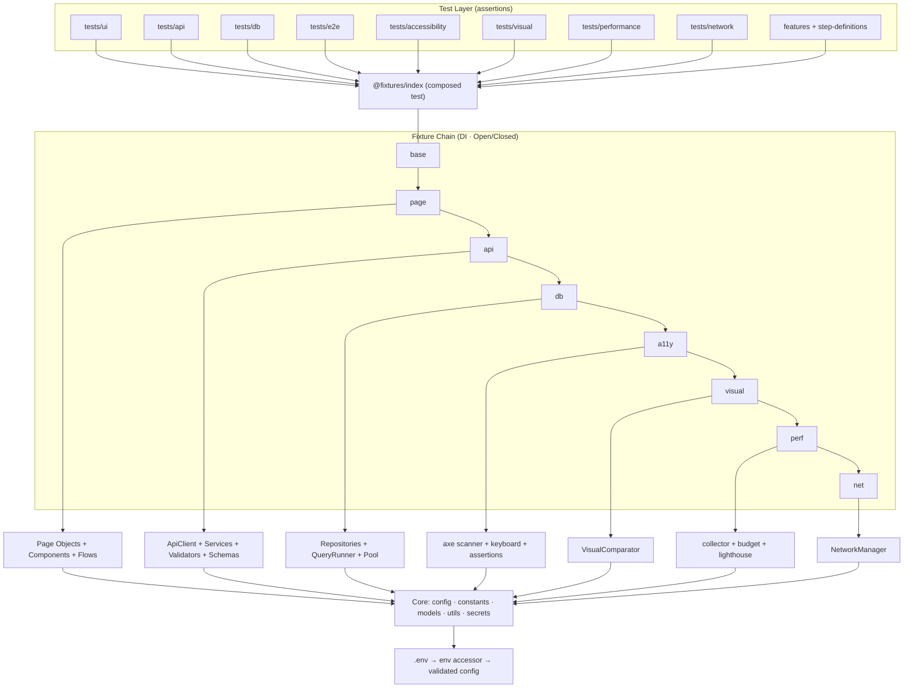

# OmniQA — Complete Architectural Analysis

> **OmniQA · Enterprise Playwright Automation Framework** — architecture, quality, risk, and recommendations.
> Derived from a full repository audit. Last synchronized: 2026-06-28.

---

## 1. Architecture Diagram



## 2. Layer Communication

| From        | To                | Mechanism                                     |
| ----------- | ----------------- | --------------------------------------------- |
| Spec        | Framework objects | Injected via fixtures (never `new` in a spec) |
| Page Object | Browser           | Playwright `Page` + web-first locators        |
| API Service | HTTP              | `ApiClient` over `APIRequestContext`          |
| Repository  | PostgreSQL        | `QueryRunner` over Singleton `pg` Pool        |
| Any layer   | Config            | `@config/config` (immutable Singleton)        |
| Any layer   | Logs              | `@utils/logger` (Winston + correlation IDs)   |
| Reporters   | Run results       | Playwright `Reporter` interface               |

## 3. Dependency Graph (high-level)

```
specs → @fixtures/index → {pages, services, repositories, a11y, visual, perf, network}
                                   │
                                   ├── @api/ApiClient ── @config, @utils, @constants, @models, @schemas
                                   ├── @database/pool ── @config, @utils
                                   └── @utils/logger ── winston (+ transport), @config
```

No circular dependencies were observed; `tsc --noEmit` validates all path-alias imports resolve.

## 4. Folder Relationships

- `tests/` and `step-definitions/` depend on `src/` (one direction only).
- `src/fixtures` is the composition root; it depends on every feature module.
- `src/config` is depended on by nearly everything and depends on nothing but `@models`.
- `scripts/db` is shared by local provisioning, CI, and Docker.

## 5. Pattern Usage

| Pattern              | Where                                             |
| -------------------- | ------------------------------------------------- |
| Page Object Model    | `src/pages`                                       |
| Component Object     | `src/components`                                  |
| Repository           | `src/repositories`                                |
| Singleton            | `src/config/config.ts`, `src/database/db-pool.ts` |
| Facade               | `src/config` (hides env parsing/validation)       |
| Dependency Injection | `src/fixtures` (8-layer chain)                    |
| Strategy             | `src/secrets` (`SecretProvider` implementations)  |
| Factory/Builder      | `data` fixture + `src/utils/random.util`          |
| Custom Reporter      | `src/custom-reporters`                            |

## 6. Strengths

- Clean separation of concerns (no assertions in `src/`).
- Config-driven, fail-fast, zero hardcoding.
- Extensible DI chain without touching call sites.
- Strict TypeScript + enforced quality gates (ESLint/Prettier/Husky/commitlint/c8/depcheck).
- Three CI systems share one Docker image and one DB-seeding path.
- Framework-owned result shapes insulate reports from vendor changes.

## 7. Weaknesses / Risk Areas

| Risk                                                       | Severity | Mitigation                                              |
| ---------------------------------------------------------- | -------- | ------------------------------------------------------- |
| Duplicated `escapeHtml`/`slugify` in a11y + perf reporters | High     | Extract `@utils/report.util` + `HtmlDashboard` base     |
| `summary-reporter` flaky field is incorrect                | High     | Authoritative `flaky-reporter` exists; remove the field |
| Dashboards re-render on every `record()` (O(n²) writes)    | Medium   | Debounce render in global teardown                      |
| Unbounded file logging                                     | Medium   | Add log rotation, env-gate file logs                    |
| Empty scaffold dirs imply unbuilt capability               | Medium   | Populate or remove (YAGNI)                              |
| Third-party demo availability (e.g. ReqRes key)            | Medium   | Gate/skip gracefully; mock via `@network`               |
| Cross-platform visual baseline drift                       | Low      | Pin baselines to the Docker image                       |

## 8. Code Quality

- **Type safety:** strict TS, `noUncheckedIndexedAccess`, no `any`. `tsc --noEmit` passes.
- **Lint/format:** `npm run verify` (typecheck + lint + format:check) is green; 0 ESLint errors (10 non-blocking warnings in 2 legacy data-driven specs).
- **Coverage:** `c8` produces `coverage/lcov.info` for SonarCloud ingestion.
- **Dependency hygiene:** `depcheck` clean; `npm audit` reports no high/critical.

## 9. Maintainability

- Consistent file-header doc blocks across `src/`.
- Per-module `README.md` for accessibility, visual, performance, network, fixtures.
- Stable public surfaces (barrels + `@fixtures/index`) keep refactors local.

## 10. Scalability

- Add a feature module + a fixture layer; specs are unaffected.
- Parallel workers + per-project isolation; sharding is the documented next step for horizontal scale.

## 11. Testability

- 137 test cases across 12 projects; web-first waits; deterministic data via Faker; network determinism via `@network`/HAR.

## 12. Security

- Secrets git-ignored + excluded from the image; AES-256-GCM vault; `maskSecret()`; parameterised SQL; CodeQL + OWASP + npm audit in CI. See [../SECURITY.md](../SECURITY.md).

## 13. Performance

- Performance budgets gate regressions; CI caches npm + browsers; Docker layer caching.

## 14. Recommendations (prioritised)

1. **High** — shared `@utils/report.util` + `HtmlDashboard` base (kills duplication + O(n²) renders).
2. **High** — remove the misleading `flaky` field from `summary-reporter`.
3. **Medium** — CI sharding; Docker-pinned visual baselines; log rotation.
4. **Low** — generic `BaseRepository<T, Id>`; prune empty scaffold dirs; first git commit + tags.
